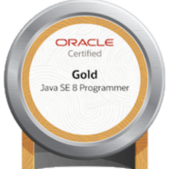

## ユーザ：Peyang

やっほー。ぺやんだよ。Java8大好き。

  <table >
    <theader>
      <tr>
        <th colspan=2>Peyang</th>
      </tr>
    </theader>
    <tbody dir="ltr">
      <tr>
        <td colspan=2 align="center"></td>
      </tr>
      <tr>
        <td colspan=2 align="center"><strong>ユーザ情報</strong></td>
      </tr>
      <tr>
        <td>ぺやんは、<a href="https://dic.nicovideo.jp/a/%E6%97%A5%E6%9C%AC%E8%AA%9E%E3%81%A7%E3%81%8Ak">日本語</a>を<a href="https://www.nicovideo.jp/watch/sm33191373">母語</a>としています。</td>
        <td align="center"> <strong>ja</strong>  </td>
      </tr>
      <tr>
        <td>Peyang is able to contribute to  
            <a href="https://dic.nicovideo.jp/a/%E3%82%AE%E3%83%95%E3%83%8F%E3%83%96">GitHub</a> with an <a href="https://togetter.com/li/1268851">intermediate</a>  level of <a href="https://www.youtube.com/watch?v=Rc2rT2eAOWk">English</a>.</td>
        <td align="center"> <strong>en-2</strong>  </td>
      </tr>
      <tr>
        <td>ぺやんは、<a href="https://dic.nicovideo.jp/a/windows%2010">Windows 10</a>を使用して OSSに貢献しています。</td>
        <td></td>
      </tr>
      <tr>
        <td>ぺやんは、主に<a href="https://letmegooglethat.com/?q=How+to+search+something+in+Google%3F">Google</a>をインター ネッツ検索に使用しています。</td>
        <td></td>
      </tr>
      <tr>
        <td>ぺやんは、<a href="https://100-matters.hatenablog.jp/entry/12021-05-02">Java 1.8</a>を 完全に理解しました。</td>
        <td align="center"> <strong>java-5</strong>  </td>
      </tr>
      <tr>
        <td>ぺやんは、<a href="https://www.jitec.ipa.go.jp/1_11seido/fe.html">基本情報技術者試験</a> に合格しています。</td>
        <td align="center"> <strong>FE</strong>  </td>
      </tr>
      <tr>
        <td>ぺやんは、<a href="https://www.jitec.ipa.go.jp/1_11seido/ip.html">ITパスポート試験</a> に合格しています。</td>
        <td align="center"> <strong>IP</strong>  </td>
      </tr>
      <tr>
        <td>ぺやんは、<a href="https://www.jitec.ipa.go.jp/1_11seido/sg.html">情報セキュリティ マネジメント試験</a>に合格 しています。</td>
        <td align="center"> <strong>SG</strong>  </td>
      </tr>
        <tr>
            <td>ぺやんは、<a href="https://education.oracle.com/ja/oracle-certified-java-programmer-gold-se-8-oracle-certified-professional-java-se-8-programmer/trackp_367">Oracle Certified Java  Programmer Gold SE8</a>
                資格を 保有しています。
            </td>
            <td align="center"></td>
    </tbody>
  </table>

